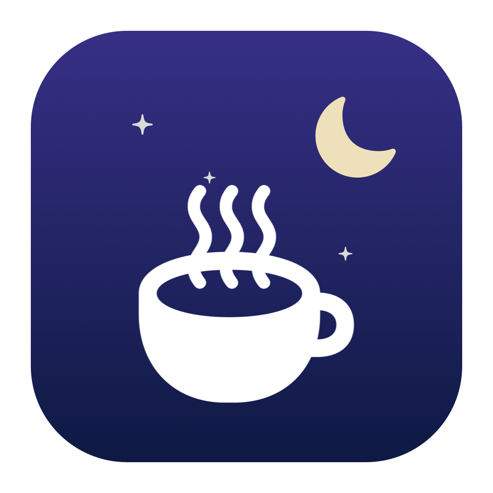

<p align="center"></p>

# ☕ KeepAwake

**One-click menu bar toggle that keeps your Mac awake.**

Born from running [Claude Code](https://claude.com/claude-code) agents overnight: nothing kills an 8-hour autonomous run like your Mac deciding it's bedtime. KeepAwake gives you one menu bar click to keep the machine up — and one click to let it sleep again.


Filled cup ☕ = your Mac stays awake. Dimmed empty cup = normal sleep.

## Features

- **One click.** Left-click the cup to toggle. No Terminal, no menus to dig through.
- **Native and tiny.** A single-file AppKit app, ~200 lines of Swift. No dependencies, no Electron, no background helpers.
- **Powered by `caffeinate`.** Uses macOS's own `caffeinate -ims` under the hood — prevents idle, disk, and system sleep. The *display* is still allowed to sleep, so overnight runs don't burn power on a lit screen.
- **Self-healing.** If something kills the `caffeinate` process, KeepAwake restarts it. If KeepAwake itself is force-quit, `caffeinate` exits with it (`-w <pid>`), so nothing is ever left silently holding your Mac awake.
- **Remembers state** across restarts, and starts at login (on by default — toggle it in the right-click menu).

## Install

Requires macOS 13+ and the Xcode Command Line Tools (`xcode-select --install`).

```bash
git clone https://github.com/MaorZ19/KeepAwake.git
cd KeepAwake
./build.sh
open /Applications/KeepAwake.app
```

`build.sh` compiles from source (a few seconds), installs to `/Applications` (or `~/Applications` if that isn't writable), and signs the app ad-hoc.

## Usage

| Action | Result |
|---|---|
| **Left-click** the cup | Toggle awake mode on/off |
| **Right-click** the cup | Menu: current state, Start at Login, Quit |

> **Battery note:** macOS always sleeps when the lid is closed on battery power — `caffeinate` can't override that. Plug in for overnight runs.

## How it works

The app owns a `caffeinate -ims -w <app pid>` child process while the toggle is on, and terminates it when off. State persists to disk, and login-item registration uses `SMAppService`. That's the whole trick — the entire app is [main.swift](main.swift).

## Control Center toggle (macOS 26) — help wanted 🙏

There's a working-in-theory Control Center control in [control.swift](control.swift): a WidgetKit `ControlWidget` that flips the same shared state via an App Intent. It compiles, embeds, and registers (`pluginkit -m -p com.apple.widgetkit-extension` lists it) — **but never appears in the Control Center controls gallery.**

Our diagnosis so far: the controls gallery appears to be built from the `Metadata.appintents` bundle that Xcode's `appintentsmetadataprocessor` generates at build time — and that tool ships **only with full Xcode**, not the Command Line Tools. Extensions without it are never even launched for enumeration.

If you know how to generate App Intents metadata without full Xcode, or can spot something else we missed — please open an issue or PR. See the pinned issue for the full investigation notes.

## License

[MIT](LICENSE)
